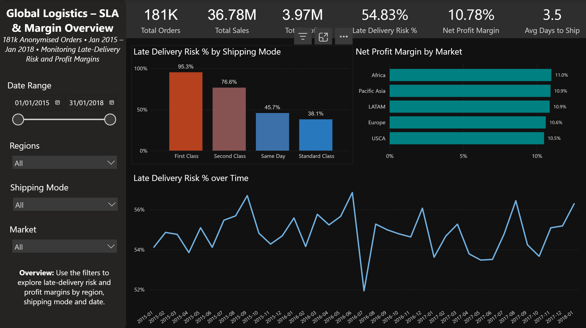
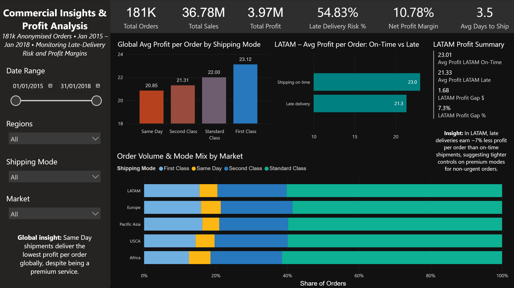

Supply Chain & Logistics Dashboard

End-to-end data project combining **Python** (for data privacy & cleaning) with **Power BI** (for modelling and visualisation). The report analyses a ~180k-row global orders dataset to understand late-delivery risk, shipping mode efficiency and profit margins.





---

## 1. Business context

A global logistics function was **hitting volume targets but missing margin goals**. Leadership wanted to understand:

* How often are we breaching **delivery SLAs**?
* How do different **shipping modes** (Standard, Second Class, Same Day, First Class) affect profitability?
* How much profit are we losing when deliveries arrive late, especially in key markets like **LATAM**?

This project turns a large flat orders file into an **operations and commercial insight dashboard**.

---

## 2. Solution overview

The project has two layers:

1. **Python anonymisation & cleaning**

   * Load the raw CSV and **strip customer-level PII**:

     * Emails, passwords, first/last names, full addresses, postcodes, etc.
   * Export a GDPR-style anonymised file for BI reporting.

2. **Power BI modelling & dashboards**

   * Build a **star schema** on top of the anonymised dataset.
   * Create measures for:

     * `Late Delivery Risk %`
     * `Average Days to Ship`
     * `Net Profit Margin`
   * Design two report pages:

     * **Page 1 – Global Logistics: SLA & Margin Overview**
     * **Page 2 – Commercial Insights & Profit Analysis**

---

## 3. Python: anonymisation & export

A small Python script (using `pandas`) is used to:

* Load the original DataCo Supply Chain CSV.

* Drop direct identifiers such as:

  * `Customer Email`, `Customer Password`
  * `Customer Fname`, `Customer Lname`
  * `Customer Street`, `Customer City`, `Customer State`, `Customer Zipcode`
  * `Order City`, `Order State`, `Order Zipcode`, `Order Country`, `Order Customer Id`
  * `Product Image` (broken URLs)

* Save the clean file as **`Global_Logistics_Anonymised.csv`**, which is used as the source for Power BI.

This simulates a **GDPR-compliant reporting dataset** and supports your CV claim about PII handling.

---

## 4. Data model & DAX (Power BI)

### Star schema

From `Global_Logistics_Anonymised.csv` the model is reshaped into:

* **Fact_Orders**

  * One row per order.
  * Key fields:

    * `Order Id`, `Customer Id`, `Product Card Id`
    * `Market`, `Order Region`
    * `Shipping Mode`
    * `order date (DateOrders)`, `Days for shipping (real)`
    * `late_delivery_risk` (0/1 flag)
    * `Sales`, `Benefit per order` (profit)

* **Dim_Customer**

  * `Customer Id`, `Customer Segment`, `Customer Country` (anonymised).

* **Dim_Product**

  * `Product Card Id`, `Category Name`.

* **Dim_Geography**

  * `Market`, `Order Region`, `Order Country`, `Order City`.

* **Dim_ShippingMode**

  * `Shipping Mode` (Same Day, Second Class, Standard Class, First Class).

* **Dim_Date**

  * Calendar table (DAX) marked as the **Date table** for time intelligence.

The model is **designed to support Row-Level Security (RLS) by `Order Region`**, so regional managers can be restricted to their own data if RLS roles are added.

### Key measures

Core DAX measures (simplified):

```dax
Total Orders =
    COUNTROWS ( 'Fact Orders' )

Total Sales =
    SUM ( 'Fact Orders'[Sales] )

Total Profit =
    SUM ( 'Fact Orders'[Benefit per order] )

Late Delivery Risk % =
VAR LateOrders =
    CALCULATE (
        [Total Orders],
        'Fact Orders'[late_delivery_risk] = 1
    )
RETURN
    DIVIDE ( LateOrders, [Total Orders], 0 )

Avg Days to Ship =
    AVERAGE ( 'Fact Orders'[Days for shipping (real)] )

Net Profit Margin =
VAR TotalProfit = [Total Profit]
VAR TotalSales  = [Total Sales]
RETURN
    DIVIDE ( TotalProfit, TotalSales, 0 )

Avg Profit per Order =
    DIVIDE ( [Total Profit], [Total Orders], 0 )
```

LATAM-specific measures used on the insights page:

```dax
LATAM Avg Profit On-Time =
CALCULATE (
    [Avg Profit per Order],
    'Dim Geography'[Market] = "LATAM",
    'Fact Orders'[late_delivery_risk] = 0
)

LATAM Avg Profit Late =
CALCULATE (
    [Avg Profit per Order],
    'Dim Geography'[Market] = "LATAM",
    'Fact Orders'[late_delivery_risk] = 1
)

LATAM Profit Gap $ =
    [LATAM Avg Profit On-Time] - [LATAM Avg Profit Late]

LATAM Profit Gap % =
    DIVIDE ( [LATAM Profit Gap $], [LATAM Avg Profit On-Time], 0 )
```

On this dataset the gap is about **7.3%**, which is what appears in the LATAM summary card.

---

## 5. Report pages

### Page 1 – Global Logistics: SLA & Margin Overview

* **KPI ribbon**

  * Total Orders
  * Total Sales
  * Total Profit
  * Late Delivery Risk %
  * Net Profit Margin %
  * Average Days to Ship

* **Filters (left sidebar)**

  * Date Range (from `Dim_Date`)
  * Order Region
  * Shipping Mode
  * Market

* **Visuals**

  * **Late Delivery Risk % by Shipping Mode** – clustered column chart comparing risk across shipping modes.
  * **Net Profit Margin by Market** – bar chart showing margin % across global markets.
  * **Late Delivery Risk % over Time** – line chart by `Year Month`, showing how risk changes over time.

This page backs up the CV statement about **SLA breaches and profit margin volatility**.

### Page 2 – Commercial Insights & Profit Analysis

* **Global Avg Profit per Order by Shipping Mode**

  * Column chart showing average profit per order for each shipping mode.
  * Confirms that **Same Day shipping is the least profitable mode globally**, despite being a premium service.

* **LATAM – Avg Profit per Order: On-Time vs Late**

  * Bar chart focused on the LATAM market only.
  * On-time orders average ~23 profit per order; late orders ~21.3.
  * Multi-card panel summarising:

    * LATAM Avg Profit (On-Time)
    * LATAM Avg Profit (Late)
    * Profit Gap ($)
    * Profit Gap (%) ≈ 7.3%

* **Order Volume & Mode Mix by Market**

  * 100% stacked bar chart showing the **share of orders by shipping mode** for each market.
  * Provides context on how often premium modes (e.g. Same Day, First Class) are used in LATAM versus other regions.

Alongside short text callouts, these visuals support your CV claim that:

* Same Day shipping is the **least profitable mode**, and
* **Late deliveries in LATAM earn ~7% less profit than on-time orders**, supporting tighter controls on premium shipping for non-urgent, low-value orders.

---

## 6. Tools & repository structure

### Tools

* **Python 3.x**

  * `pandas` for CSV loading, PII removal and export.
* **Power BI Desktop**

  * Power Query for shaping the flat file.
  * Data modelling (star schema).
  * DAX for KPIs and the LATAM profit gap analysis.

### Suggested repo layout

```text
global-supply-chain-logistics-dashboard/
├─ README.md                         # This file
├─ Global_Supply_Chain_Logistics.pbix
├─ scripts/
│  └─ data_anonymiser.py             # Python PII stripping script
├─ data/
│  └─ README_data.md                 # Notes on the Kaggle source + schema
└─ images/
   ├─ dashboard_overview.png         # Page 1 screenshot
   └─ insights_efficiency.png        # Page 2 screenshot
```

You can adjust filenames to match whatever you’ve actually uploaded.

---

## 7. How to use

1. **Clone or download** this repository.
2. (Optional) Run the Python script to regenerate `Global_Logistics_Anonymised.csv` from the original Kaggle file.
3. Open `Global_Supply_Chain_Logistics.pbix` in **Power BI Desktop**.
4. Use the slicers and pages to explore:

   * **Page 1 – SLA & Margin Overview** for operational KPIs.
   * **Page 2 – Commercial Insights & Profit Analysis** for shipping mode and LATAM profit insights.
